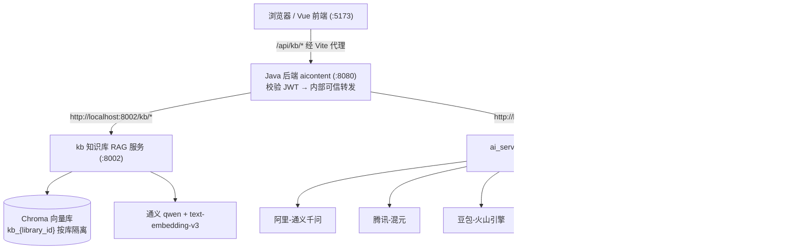

# 企业知识库智能助手 + 多模型接入服务（kb monorepo）

本仓库是一个 **monorepo**，包含两个相互独立、可单独部署运行的 Python 服务（模块）：

| 模块 | 目录 | 端口 | 职责 |
|---|---|---|---|
| 知识库 RAG 服务 | `kb/` | 8002 | 企业文档知识库问答（RAG） |
| 多模型接入网关 | `ai_service/` | 8000 | 统一接入 6 家大模型厂商 |

两个模块共享同一份根目录 `.env`（密钥集中管理），但各自是独立进程、独立端口，互不干扰。

> 从零跑起来（配置 + 启动分步操作）请读 [`docs/知识库配置与启动清单.md`](./docs/知识库配置与启动清单.md)。
> 最关键的一步：**去 [阿里云百炼控制台](https://dashscope.console.aliyun.com/) 创建 API Key，填进 `kb/.env` 的 `DASHSCOPE_API_KEY`**。

---

## 一、整体架构（流程图）



**设计要点**
- **多租户隔离**：每个用户可建多个知识库（`library_id`），Chroma 中每个库对应独立 collection（`kb_{library_id}`），向量互相不可见。
- **命令与查询分离**：文档向量存 Chroma（Python 侧），元信息（`kb_library` / `kb_document`）存 MySQL（Java 侧），通过 `doc_id` 关联。
- **Java 代理**：Python 不解析 JWT、不直连公网；所有请求由 `aicontent` 校验身份后转发，并以服务端可信身份覆盖 `user_id` / `library_id`，防止越权。
- **端口约定**：知识库 **8002**，多模型网关 **8000**，互不冲突。

---

## 二、模块一：kb（企业知识库 RAG 服务，:8002）

基于 **Python + LangChain + Chroma + 通义千问** 的企业内部文档知识库问答服务。
由 Java 后端 `aicontent`（:8080）通过 `/api/kb/*` 代理调用，**不暴露公网、不解析 JWT**，安全边界交给 Java 侧。

### 1. 功能
- 上传企业文档（PDF / Word / Excel / Markdown / TXT），自动解析 → 中文切分 → 向量化入库
- 基于 RAG 的智能问答，支持 **SSE 流式输出** + **来源引用**（文件名 + 片段）
- 多知识库：每用户可建多个库，问答时指定 `library_id`
- 严格守界：资料无答案时明确告知「无法回答」，不编造（prompt 已约束）

### 2. 目录结构
```
kb/
├── main.py          # FastAPI 入口，挂路由 + /kb/health 健康检查
├── config.py        # 配置：通义 Key、Chroma 路径、模型参数（环境变量注入）
├── schemas.py       # Pydantic 请求模型（ChatRequest）
├── llm.py           # 通义 qwen 流式对话 + text-embedding-v3 封装
├── loader.py        # 文档解析（pdf/docx/xlsx/md/txt）
├── splitter.py      # 中文切分（RecursiveCharacterTextSplitter，按句号/段落）
├── rag.py           # RAG 核心：检索 + 拼 prompt + 流式生成
├── vectorstore.py   # Chroma 封装：按 library_id 建 collection、增删查
├── chroma_data/     # 向量持久化目录（运行时生成，已 gitignore）
└── routers/
    ├── chat.py      # 问答（SSE 流式）
    └── document.py  # 上传 / 删除文档
```

### 3. 配置项（.env，见 `.env.example`）
| 变量 | 默认值 | 说明 |
|---|---|---|
| `DASHSCOPE_API_KEY` | 空 | 通义百炼 API Key，用于 qwen 对话 + text-embedding-v3（**必填**） |
| `KB_PORT` | `8002` | 服务端口（Java 侧 `kb.python-url` 需对应） |
| `CHROMA_DIR` | `./chroma_data` | Chroma 向量持久化目录（相对/绝对均可） |
| `LLM_MODEL` | `qwen-turbo` | 对话模型，可换 `qwen-plus` / `qwen-max` |
| `EMBEDDING_MODEL` | `text-embedding-v3` | 向量化模型 |
| `EMBEDDING_DIM` | `1024` | 向量维度（换 embedding 模型需同步改） |
| `RETRIEVE_TOP_K` | `5` | 每次检索召回的相关片段数 |

> 通义兼容端点：`https://dashscope.aliyuncs.com/compatible-mode/v1`（见 `kb/config.py`）。

### 4. 启动
```bash
cd kb
uvicorn kb.main:app --host 0.0.0.0 --port 8002 --reload
```
- 健康检查：`GET http://localhost:8002/kb/health` → `{"status":"ok","service":"kb-server","port":8002}`
- API 文档（自动生成）：`http://localhost:8002/docs`

### 5. 接口契约（内部调用，由 Java 代理）
**上传文档**
```
POST /kb/documents/upload
Content-Type: multipart/form-data
Body: file(文件), user_id(表单), library_id(表单)
```
响应：
```json
{ "docId": "uuid", "filename": "手册.pdf", "chunkCount": 42, "status": "ready", "createdAt": "2026-07-14T22:00:00.000000" }
```
**删除文档（同步清向量）**
```
DELETE /kb/documents/{doc_id}?user_id={uid}&library_id={libId}
```
响应：`{"deleted": true}`

**问答（SSE 流式）**
```
POST /kb/chat
Content-Type: application/json
Body: {"user_id": 1, "library_id": 7, "question": "退货流程？", "history": [{"role":"user","content":"..."}]}
```
SSE 事件（每行 `data: <json>`）：
```
data: {"type":"content","text":"根据"}          # 多次，拼接为完整回答
data: {"type":"done","sources":[{"filename":"手册.pdf","snippet":"..."}]}
data: {"type":"error","text":"..."}             # 异常时
```

### 6. 数据流
1. **入库**：前端上传 → `aicontent` 验 JWT → 转发文件到 `/kb/documents/upload` → Python 解析切分 → Chroma 写入 `kb_{library_id}` → 返回 `docId` → Java 落 `kb_document` 元信息。
2. **问答**：前端 → `aicontent /api/kb/chat`（SSE）→ 覆盖可信 `user_id/library_id` → 转发 `/kb/chat` → Python 对问题向量化 → Chroma 检索 top-k → 拼 prompt → qwen 流式生成 → 透传回前端。

### 7. 排错
| 现象 | 排查 |
|---|---|
| 启动报 `DASHSCOPE_API_KEY` 相关错误 | 确认 `.env` 已填且路径正确（`kb/config.py` 读取同目录 `.env`） |
| 上传后 `chunkCount=0` | 文档可能是扫描版 PDF / 纯图片，无文本层；或格式未支持（见 loader） |
| 问答返回 `error` | 检查通义 Key 额度、网络；看 Python 控制台堆栈 |
| 删除文档 Java 端报 400 | Java 用查询参数调用，Python 必须 `Query(...)` 接收（已对齐） |
| Chroma 写入慢 | 首次会下载模型/建索引；后续增量快 |

---

## 三、模块二：ai_service（多模型统一接入网关，:8000）

对前端 / 其他服务提供**统一的模型调用入口**，屏蔽各家厂商 SDK 差异，支持流式（SSE）与非流式。模型名按前缀或 `厂商:模型` 语法自动路由到对应厂商。

### 1. 接口
```
POST /generate      统一生成（流式 SSE / 非流式，可指定任意厂商模型）
POST /doubao_chat   豆包专用接口（默认豆包模型）
GET  /providers     查看已接入厂商及配置、Key 获取地址、文档地址
```
- `/generate` 请求体：`{"prompt": "...", "model": "qwen-plus", "stream": true, "max_tokens": 2048}`
- `/providers` 会直接返回各厂商的 `console_url`（拿 Key 地址）与 `doc_url`（文档地址），等价于本文「五、相关信息获取地址」。

### 2. 模型路由
| 前缀 / 写法 | 厂商 | 默认模型 |
|---|---|---|
| `qwen*` | 阿里-通义千问 | qwen-plus |
| `hunyuan*` | 腾讯-混元 | hunyuan-turbo |
| `doubao*` | 豆包-火山引擎 | doubao-seed-2-0-pro-260215 |
| `deepseek*` | DeepSeek | deepseek-chat |
| `gpt*` / `o1*` / `o3*` / `codex*` | OpenAI | gpt-4o-mini |
| `claude*` | Anthropic-Claude | claude-sonnet-4-0 |
| `厂商key:模型`（如 `openai:gpt-4o`） | 显式指定厂商 | — |

### 3. 配置（ai_service/config.py，读根目录 `.env`）
- `AI_SERVICE_PORT`（默认 8000），与 `KB_PORT` 互不冲突
- 各家密钥见 `.env.example`：`DASHSCOPE_API_KEY` / `HUNYUAN_API_KEY` / `ARK_API_KEY` / `DEEPSEEK_API_KEY` / `OPENAI_API_KEY` / `ANTHROPIC_API_KEY`

### 4. 启动
```bash
cd kb
uvicorn ai_service.main:app --host 0.0.0.0 --port 8000 --reload
```
- API 文档：`http://localhost:8000/docs`

### 5. 排错
| 现象 | 排查 |
|---|---|
| 调用某厂商返回鉴权错误 | 确认对应环境变量（如 `ARK_API_KEY`）已在 `.env` 填好 |
| `claude*` 调用报未安装 SDK | `pip install anthropic` |
| 模型名无法路由 | 检查前缀是否在上表；或用 `厂商key:模型` 显式指定 |

---

## 四、仓库目录结构（总览）

```
kb/                                  # 仓库根（monorepo）
├── kb/                              # 模块一：知识库 RAG 服务（:8002）
│   ├── main.py                      # FastAPI 入口 + /kb/health
│   ├── config.py                    # 配置（通义 Key / Chroma / 模型）
│   ├── schemas.py                   # Pydantic 请求模型
│   ├── llm.py                       # 通义 qwen 流式 + text-embedding-v3
│   ├── loader.py                    # 文档解析（pdf/docx/xlsx/md/txt）
│   ├── splitter.py                  # 中文切分
│   ├── vectorstore.py               # Chroma 封装（按 library_id 隔离）
│   ├── rag.py                       # 检索 + 拼 prompt + 流式生成
│   ├── pyproject.toml               # 打包配置（包名 kb-server，命令入口 kb-server）
│   ├── chroma_data/                 # 向量持久化（运行时生成，gitignore）
│   └── routers/
│       ├── chat.py                  # 问答（SSE）
│       └── document.py              # 上传 / 删除文档
├── ai_service/                      # 模块二：多模型接入网关（:8000）
│   ├── main.py                      # 路由 /generate /doubao_chat /providers
│   ├── config.py                    # 端口配置
│   ├── providers.py                 # 厂商配置 + Provider 抽象 + 路由
│   └── pyproject.toml               # 打包配置（包名 ai-service，命令入口 ai-service）
├── docs/
│   └── 知识库配置与启动清单.md        # 从零跑起来分步清单
├── requirements.txt                 # 依赖（FastAPI / Chroma / LangChain / openai / anthropic / 解析库）
├── .env.example                     # 环境变量模板（复制为 .env 填 Key）
├── .gitignore                       # 忽略 .env / venv / chroma_data / 日志 / 临时文件
└── README.md
```

---

## 五、相关信息获取地址（去哪里拿 Key / 文档）

### 1. 大模型厂商（ai_service 与各模型调用）
| 厂商 | API Key 获取地址（控制台） | 接口文档 |
|---|---|---|
| 阿里-通义千问 | https://dashscope.console.aliyun.com/ | https://help.aliyun.com/zh/dashscope/developer-reference/quick-start |
| 腾讯-混元 | https://console.cloud.tencent.com/hunyuan | https://cloud.tencent.com/document/product/1729 |
| 豆包-火山引擎 | https://console.volcengine.com/ark | https://www.volcengine.com/docs/82379/ |
| DeepSeek | https://platform.deepseek.com/ | https://api-docs.deepseek.com/zh-cn/ |
| OpenAI | https://platform.openai.com/ | https://platform.openai.com/docs/api-reference |
| Anthropic-Claude | https://console.anthropic.com/ | https://docs.anthropic.com/en/api/messages |

> 通义百炼 OpenAI 兼容端点：`https://dashscope.aliyuncs.com/compatible-mode/v1`（见 `kb/config.py` 与 `ai_service/providers.py`）。
> 以上地址同时可由 `GET /providers` 接口在运行时返回。

### 2. 知识库服务依赖
- **通义百炼**（qwen 对话 + text-embedding-v3 向量化）：见上表「阿里-通义千问」；需在「模型广场」开通 `qwen-turbo`、`text-embedding-v3` 并保有额度。
- **Chroma**（本地向量库，随 `pip install` 自动安装，无需注册）。
- **Java 后端 aicontent**（:8080，代理 + JWT 校验，独立仓库）。

### 3. 本仓库文档
- 从零跑起来（配置 + 启动分步）：[`docs/知识库配置与启动清单.md`](./docs/知识库配置与启动清单.md)
- 接口自动文档（服务启动后）：`http://localhost:8002/docs`、`http://localhost:8000/docs`

---

## 六、快速开始（两个模块一起跑）

```bash
cd kb
# 0. 准备通义百炼 API Key（必填）：
#    打开 https://dashscope.console.aliyun.com/ → 右上角 API-KEY → 创建
#    并在「模型广场」开通 qwen-turbo、text-embedding-v3（需有额度）

# 1. 虚拟环境（建议 Python 3.10+；本机 3.8.9 可跑但兼容性边缘）
python -m venv venv
source venv/bin/activate          # Windows: venv\Scripts\activate

# 2. 装依赖（二选一）
#    方式 A：一次性装全部（最简单，只跑服务用这个即可）
pip install -r requirements.txt
#    方式 B：按包安装（更规范，每个模块是独立可分发包，并生成命令行入口）
#    注意：务必在“已激活的虚拟环境”里执行，否则会装到系统 Python，
#         命令入口不在 PATH 上，导致 kb-server / ai-service 敲不出来。
#    -e 为可编辑安装（editable）：改代码即时生效，无需重装。
pip install -e ./kb -e ./ai_service

# 3. 配置密钥
cp .env.example .env              # 编辑 .env，把 DASHSCOPE_API_KEY 等改成你的真实 Key

# 4. 启动两个服务（各开一个独立窗口常驻）
uvicorn kb.main:app --host 0.0.0.0 --port 8002 --reload
uvicorn ai_service.main:app --host 0.0.0.0 --port 8000 --reload

# 若用方式 B 安装，可直接用包提供的命令入口启动（等价于上面的 uvicorn）：
#   kb-server        # 由 kb/pyproject.toml 的 [project.scripts] 生成，端口读 KB_PORT
#   ai-service       # 由 ai_service/pyproject.toml 的 [project.scripts] 生成，端口读 AI_SERVICE_PORT
# 命令入口安装在 <venv>/Scripts/（Windows）或 <venv>/bin/（Linux/macOS），
# 需先激活该 venv 才能直接调用；用 `where kb-server`（Windows）/ `which kb-server` 可确认位置。
```

---

## 七、部署为独立仓库（推送到 GitHub）

本目录是独立 git 仓库，推送到 `https://github.com/lhy157/knowledge-base.git`：

```bash
cd kb
git add -A
git commit -m "feat: 知识库 + 多模型接入 monorepo (FastAPI + Chroma + 通义)"
git branch -M main
git remote add origin https://github.com/lhy157/knowledge-base.git
git push -u origin main        # 用户名 lhy157，密码处粘贴 GitHub Personal Access Token
```

> 注意：`.env`（真实 Key）、`venv/`、`chroma_data/`（向量）、`*.log`、`.tmp/` 已在 `.gitignore` 中忽略，不会上传。
> 拉取后在本地 `cp .env.example .env` 填 Key 即可运行。
